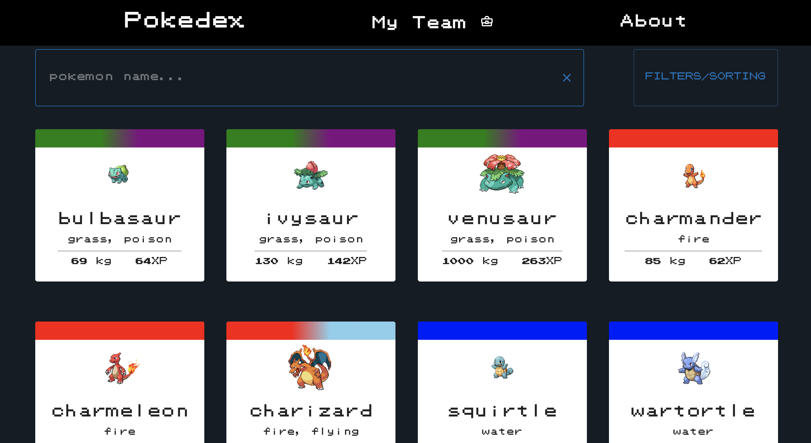
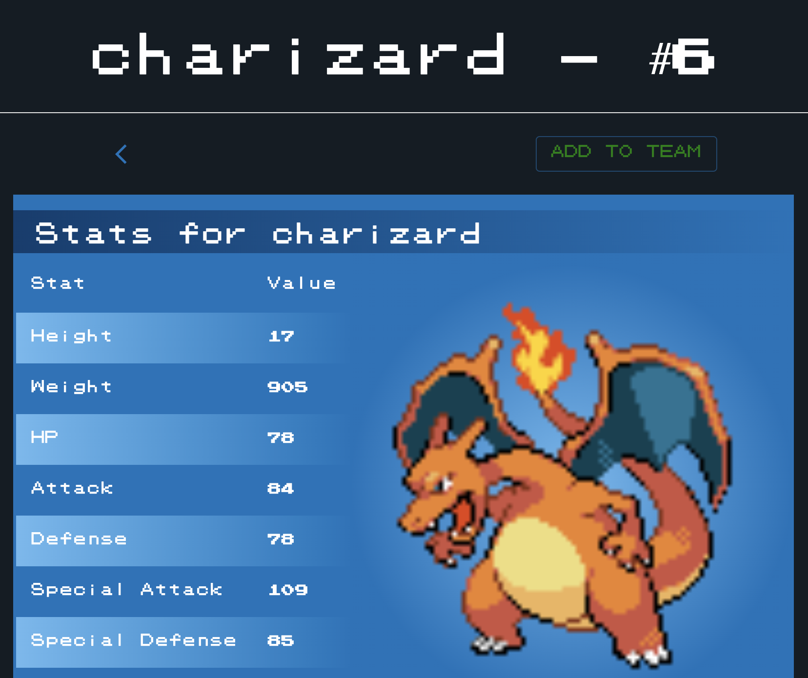

# Choices

### Team on localstorage

When a user visits a given pokemon they have the opportunity to press a “ADD TO TEAM” button. This will add the pokemon to a team that can be found under the “My Team” tab. The team consists of up to six pokemons that the user can choose freely.

The team is stored in localstorage and not in the database. We have chosen to do this because we don’t see it necessary to save the team to the database as there is no interaction with other peoples teams. We also don’t have a login/user function which makes a browser a user (as you get a userID). Therefore we find it suitable to save the team in localstorage. If we were to develop this application further we would store the team in the database in a similar way to reviews and all the pokemons. This would allow a user to perhaps search for pokemon teams of other users.

### Session storage

We have chosen to use session storage to store the state of the filters, sorting and pagenumber. This is because when we have tested the app we found it satisfying to have keep the state when refreshing the page. If the user wants to refresh the page, they can do so by pressing the “Pokedex” button in the navbar. This will reset the state of the filters, sorting and pagenumber. In earlier versions the search state was also stored in session storage, but we found that this was not necessary as it is more annoying to be forced to delete the search on refresh than to have to type it again.

### Delayed search

When searching for a pokemon the application will wait for 600 milliseconds after the last keystroke before sending a query to the database. We considered two different approaches to searching. The first is sending a query after each keystroke immediately and the second one is implementing a “send” button that the user had to click in order to send the query.

The reason we have chosen our approach, is because waiting 600 milliseconds makes sure that we don’t send too many requests to the database. This would not have been sustainable. At the same time the user does not have to stop and press a button to get a response, they just have to wait a small amount of time. We found this approach to be a suitable middleground between the two other approaches.

### Colors

### Overall theme

We have chosen to go for dark colors on the website as this suits the theme very well. A further development of the application should involve a light-theme, but this is not something we have prioritized in this version.

### Colorful pokemon cards

The pokemon cards have a lot of different colors. This is because our target users are kids and young adults who for the most part have good vision. The bright and vibrant colors also go very well with the dark background of the page.

### Font

The font for the page is inspired by the old pokemon games. This is a very retro style and hopefully brings nostalgia to the user. The font does not go very well with Norwegian characters such as “æøå”, but the application is in English and therefore this should not be a too big of a problem.

### Resolution

On delivery two we received a comment that said the picture resolution for the pokemons were of too low quality. As mentioned in the font section we are going for a retro style that matches the old pokemon games. We have therefore decided to ignore this comment.

### End-to-end testing

We created several end-to-end tests. Normally you want to test every aspect of the application. In our case, we made e2e tests for every aspect of the app that don’t generate user-data. That means that our pokemon-review function is not tested through e2e. In a professional app-development we would have made a test-database that could host the tests and therefore it would not be a problem to write test-reviews. But in our case, we have to make it simple enough that people can use it and reproduce it. It should also be available for students to run the tests when doing the peer evaluation. Therefore we tested the reviews-function manually. (See piazza @177).

We do not have separate backend-tests to test the queries, but instead test them through the e2e tests. An example of this is the filter-test which checks that we get the correct pokemons according to the filters.

### Component testing

We have made component tests for several of the components we have in out app. In some of the tests, the coverage rate is not that high. This is because some of the functionality is tested through the end-to-end tests.

### Recoil

We have used the recoil to store the state of filters, sorting, search, pages and team. We have chosen to use recoil because it is easy to use and it is easy to share the state between components. 

Most of these states are used in multiple components, and therefore it is nice to have them in recoil. The team is also stored in local storage. The reason for this is that while also wanting to have them available in recoil state to have easy access to its state, and at the same time keep the user experience we want by saving it in localstorage. 
We have modified atoms.tsx so that it is possible to store atoms without adding them to session storage. We see the search value as not necessary to have in session storage, so it is only stored as a recoil state. The majority of the atoms are still stored in session storage as well, but the implementation has been changed so that unnecessary calls to session storage are not made. Regardless of whether the states are stored in session storage or not, they are all used in various components, and here we see recoil state as necessary.

### Accessibility

We've integrated keyboard navigation and text-to-speech features into our application to prioritize inclusivity and user-friendly design. Keyboard navigation allows individuals with motor impairments or those who navigate without a traditional mouse to interact seamlessly with our application. Meanwhile, text-to-speech functionality caters to users with visual impairments, offering an alternative way to consume content. This can be experienced using a browserextension such as
https://chromewebstore.google.com/detail/screen-reader/kgejglhpjiefppelpmljglcjbhoiplfn (if you're using Chrome.)

### Sustainability

In regards to sustainability we've taken some consideration in terms of page loading, color/font cost, and the use of images. We've minimized navigable pages, consolidating elements like the review form with corresponding Pokémon on the same page. While dynamic pagination may not be the most optimal for sustainability, it aligns with functional requirements. We have also gotten a few comments on the poor image quality of each Pokémon, but switching to the use of higher quality images would ultimately result in a higher energy usage. Our application's background theme is dark by default, hence why we've decided not to prioritize the implementation of darkmode. Although we acknowledge that our choice of fontstyle and design of Pokémon cards might not be optimal in terms of sustainability, they are still deliberate choices we find worth the cost.
